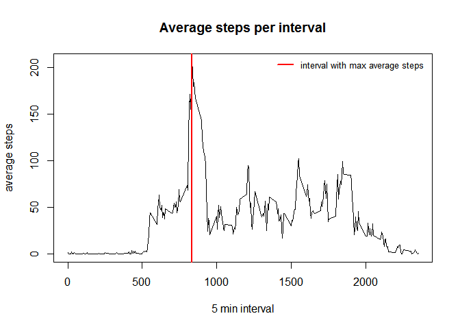

# Reproducible Research: Peer Assessment 1


##Loading and preprocessing the data

```r
setwd("C:/Users/rohit/Desktop/Coursera Data Science Specialization/Reproducible Research")
activity_data=read.csv("activity.csv")

remove_na=activity_data[complete.cases(activity_data),]
```


##What is mean total number of steps taken per day?


Plotting Histogram:

```r
sum1=aggregate(remove_na$steps, by=list(remove_na$date), FUN=sum)
names(sum1)=c("date","sum_of_steps")

hist(sum1$sum_of_steps, col="light pink", main="Histogram of steps per day", xlab="steps/day", ylab="frequency of days")
abline(v=mean(sum1$sum_of_steps), lwd=2, col="red")
abline(v=median(sum1$sum_of_steps), lwd=2, col="blue")
legend("topright",c("mean", "median"), cex=0.8, col=c("red", "blue"), lwd=c(2,2), bty="n")
```

 


##Mean total number of steps taken per day:*

```r
mean(sum1$sum_of_steps, na.rm=T)
```

```
## [1] 10766.19
```

*Median total number of steps taken per day*

```r
median(sum1$sum_of_steps, na.rm=T)
```

```
## [1] 10765
```


##What is the average daily activity pattern?

Make a time series plot (i.e. type = "l") of the 5-minute interval (x-axis) and the average number of steps taken, averaged across all days (y-axis)


```r
mean=aggregate(remove_na$steps, list(remove_na$interval), mean)
names(mean)=c("interval", "avg_steps")


plot(mean$interval, mean$avg_steps, type="l", ylab="average steps", xlab="5 min interval", main="Average steps per interval")

abline(v=subset(mean, mean$avg_steps==max(mean$avg_steps), select="interval"), col="red", lwd=2)

legend("topright",c("interval with max average steps"), cex=0.8, col="red", lwd=c(2,2), bty="n")
```

 

Which 5-minute interval, on average across all the days in the dataset, contains the maximum number of steps?

```r
subset(mean, mean$avg_steps==max(mean$avg_steps), select=c("interval","avg_steps"))
```

```
##     interval avg_steps
## 104      835  206.1698
```


##Imputing missing values

Calculate and report the total number of missing values in the dataset (i.e. the total number of rows with NAs)

```r
sum(!complete.cases(activity_data))
```

```
## [1] 2304
```


Assigning mean for the 5 min interval corresponding to missing values in the dataset. 

```r
a=activity_data[is.na(activity_data$steps),]
new_data=merge(select(a,date, interval),mean, by="interval" )
new_data=rbind(select(new_data, steps=avg_steps, date, interval), remove_na)
```

*Plotting Histogram for new data*

```r
sum2=aggregate(new_data$steps, by=list(new_data$date), FUN=sum)
names(sum2)=c("date","sum_of_steps")

hist(sum2$sum_of_steps, col="light green", main="Histogram of steps per day", xlab="steps/day", ylab="frequency of days")
abline(v=mean(sum2$sum_of_steps), lwd=2, col="red")
abline(v=median(sum2$sum_of_steps), lwd=2, col="blue")
legend("topright",c("mean", "median"), cex=0.8, col=c("red", "blue"), lwd=c(2,2), bty="n")
```

 


*Mean total number of steps taken per day:*

```r
mean(sum2$sum_of_steps)
```

```
## [1] 10766.19
```

*Median total number of steps taken per day: is same as the mean calculated above.*

```r
median(sum2$sum_of_steps)
```

```
## [1] 10766.19
```


Number of days having steps per day in the range of 10K to 15K have increased from ~30 to 35.


```r
par(mfrow=c(1,2))


hist(sum1$sum_of_steps, col="light pink", main="Histogram of steps per day - Old", xlab="steps/day", ylab="frequency of days", ylim=c(0,35))
abline(v=mean(sum1$sum_of_steps), lwd=2, col="red")
abline(v=median(sum1$sum_of_steps), lwd=2, col="blue")
legend("topright",c("mean", "median"), cex=0.8, col=c("red", "blue"), lwd=c(2,2), bty="n")


hist(sum2$sum_of_steps, col="light green", main="Histogram of steps per day - New", xlab="steps/day", ylab="frequency of days")
abline(v=mean(sum2$sum_of_steps), lwd=2, col="red")
abline(v=median(sum2$sum_of_steps), lwd=2, col="blue")
legend("topright",c("mean", "median"), cex=0.8, col=c("red", "blue"), lwd=c(2,2), bty="n")
```

 

##Are there differences in activity patterns between weekdays and weekends?

Weekends show higher activity per interval than weekdays.


```r
a=new_data
a$date=as.Date(a$date, "%Y-%m-%d")
a$day=weekdays(a$date,T)
a[a$day %in% c("Sat" ,"Sun"),]$day="Weekend"
a[a$day !="Weekend",]$day="Weekday"
a$day=as.factor(a$day)
mean=aggregate(a$steps, list(a$interval,a$day), mean)
names(mean)=c("interval","day", "avg_steps")
xyplot(avg_steps~interval|day,data=mean,type="l",layout=c(1,2), main="Weekend vs. Weekday avg steps per interval")
```

 
